# RUIVO的模块化相邻加成教程

## 1.1. 前言

本教程将介绍如何使用**模块化相邻加成** 模组提供的相邻加成系统。该系统可以通过简单的 SQL 插入表语句，为区域添加丰富和动态的相邻加成，包括单元格 plot 、区域 district 、城市 city 、玩家 player 、全局状态 game 等各种维度，同时也支持包括住房、宜居度等在内的广义上的加成，而不止于简单的6种基础加成，此外，本mod完全有能力复现文明6所有相邻加成。

本mod在极大多数情况下不会与任何mod发生冲突，除非有意与本mod使用同样的变量名或者基于本mod编写错误的代码，不过在UI兼容上还待定，因为文明6的代码框架注定了在UI界面上的修改的mod会互相打架。

## 1.2. 致谢

特别感谢所有在lua方面进行探索的modder，比如Hemmelfort、枫叶、优妮、Pen、Ophidy，以及大量modder的优质mod，让我迅速累积了大量经验来完成本教程。[1]这句话来自[糸七大佬的教程](https://github.com/SiQi-1/Siqi-mod--/blob/main/Siqi%E7%9A%84%E6%96%87%E6%98%8E6mod%E6%95%99%E7%A8%8B.md)的致谢。

同时也感谢文明6的著名modder大佬Sukritact，他应该是最先在文明6里使用二进制方法完成数值关联的实现思路（虽然我做完这个mod的时候还不知道suk大佬已经做过了，重复发明轮子这一块）

总之，屹立于巨人之肩，感谢广大文明6modders和文明6players的支持，我们将创造文明6新的未来！

作者：Ruivo

# 2. 前置知识

首先，想使用模块化相邻加成系统（Modular Adjacency Bonus System，简称MAB），你得会写mod，这个请参考以下教程：

* Hemmelfort的[Github](https://github.com/Hemmelfort/Civ6ModdingNotes)和[Gitee](https://gitee.com/Hemmelfort/Civ6ModdingNotes)，以及b站[视频](https://www.bilibili.com/video/BV1VW411U7tN/)和专栏。
* 枫叶的[文明6lua教程](https://github.com/FYMapleLeaves/ml-civ6-lua-tutorial/blob/main/%E6%9E%AB%E5%8F%B6%E7%9A%84%E6%96%87%E6%98%8E6lua%E6%95%99%E7%A8%8B.md)。
* 糸七的[文明6mod教程](https://github.com/SiQi-1/Siqi-mod--/blob/main/Siqi%E7%9A%84%E6%96%87%E6%98%8E6mod%E6%95%99%E7%A8%8B.md)。

而且，会写.sql是必要的，我们后文均以sql结构化语句进行教程，而且sql是被推荐的，虽然你完全可以使用.xml来写，因为文明6的绝大部分代码都是数据库的 **“预制菜”**，sql和xml代码本质上都是对数据库进行操作

文明6常用目录

  * Log位置（伟大建设者包更新后）：**C:\Users\用户\AppData\Local\Firaxis Games\Sid Meier's Civilization VI\Logs**
  * 非创意工坊mod放置位置：**C:\Users\用户\文档\My Games\Sid Meier's Civilization VI\Mods**
  * 文明6游戏文件目录（Steam）：**\Steam\steamapps\common\Sid Meier's Civilization VI**
  * Steam创意工坊mod文件目录：**\Steam\steamapps\workshop\content\289070**
  * 真实数据库拷贝本目录（！非常重要！）：**C:\Users\\用户\AppData\Local\Firaxis Games\Sid Meier's Civilization VI\Cache**

其次，你写涉及到本mod数据表操作的.sql和.xml文件的加载顺序不应该超过 **“1919810”**，也就是说你正常情况下不刻意去写加载顺序即可。

最后，如果你想判断本mod是否开启，可以去 **GlobalParameters** 这张表中查看 **RUIVO_MODULAR_ADJACENCY_BONUS_ABLED** 参数是否为 **1** 即可，这个全局数据会在前端和游戏中加载。

PS：不要在文明6 develop tool 里新建 sql 文件，会失效，最好下个类似 VScode 的编辑器去创建一个 sql 文件，当然你直接把本mod 的 sql 文件复制+清空拿去用也行。

# 3. 相邻加成实例写法教程

## 3.1. 基础

我们知道，文明6原版的相邻加成非常贫瘠，只有相邻“区域”“资源”“改良”“地貌”等很平常的方法，甚至连商业中心的“相邻一条河流”都显得有些特色了，但是，明明有那么多可作为加成的单元格属性，为什么不能拿来用呢，那么，本mod可以实现极为丰富的方法。

### 3.1.1. 示例-商业中心从相邻每段河流获得金币加成

话不多说，我们先来试一个想法：**商业中心从相邻每段河流+1金币** ，因为河流明明有好几段，怎么能因为就相邻一条河流就给点加成呢？看看这一段代码↓：

```sql
INSERT INTO Ruivo_New_Adjacency 
(ID, 
 DistrictType,               YieldType,   YieldChange,  AdjacencyType,  DistrictModifiers, ApplyForUniqueDistricts) VALUES
('RUIVO_DISTRICT_COMMERCIAL_HUB_YIELD_GOLD_FROM_RIVER_CROSSING', 
 'DISTRICT_COMMERCIAL_HUB', 'YIELD_GOLD', 1,           'FROM_RIVER_CROSSING',           1,                       1);
```

把这个写进去后，我们惊喜地发现：成了！现在商业中心会从相邻的每一段河流获得加成，这个加成最高应该能做到5，因为一个单元格河流最多邻接5个面！而且，特色区域也能生效！

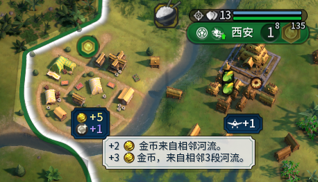

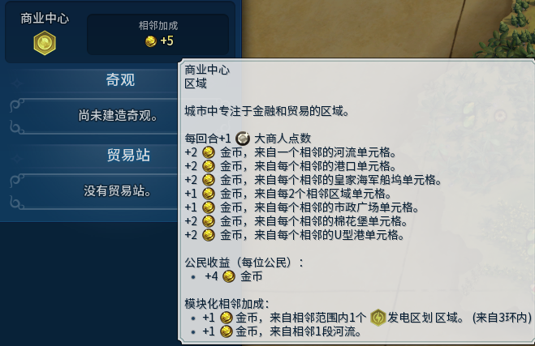

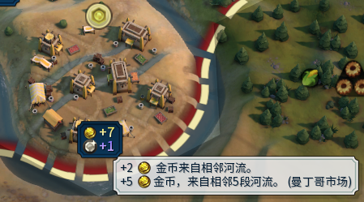

好的，接下来我们来分析参数：在不涉及自定义的情况下，我们所有的操作均围绕 **Ruivo_New_Adjacency** 表进行

#### 3.1.1.1. 参数: ID 唯一标识

首先， ID 是唯一标识符，表的**主键**，建议命名规范为 “你自己的名字_区域名称_产出名称_相邻来源”，当然如果你有自信不会和别人撞车的话，起名随你如意即可。你要嫌长写个abcd进去都行。

但是请注意，这些填入的必须都是英文！

#### 3.1.1.2. 参数: DistrictType 区域类型

相邻加成作用的区域，填啥东西，但是区域一定是来自 Districts 这张表的定义的 DistrictType ，你填原本区域、mod区域，自己加的区域、特色区域，只要是区域，都行！

#### 3.1.1.3. 参数: YieldType 产出类型

在不填 ProvideType 的情况下， 你填入的 YieldType 必须来自于 Yields 表定义的原版6种产出，也就是：

| YieldType        | 意思   |
| ---------------- | ------ |
| YIELD_FOOD       | 食物   |
| YIELD_PRODUCTION | 生产力 |
| YIELD_GOLD       | 金币   |
| YIELD_SCIENCE    | 科技值 |
| YIELD_CULTURE    | 文化值 |
| YIELD_FAITH      | 信仰值 |

但是我必须告诉你的是： YieldType 不止于此，后面还有更劲爆的内容！！详见 Ruivo_ProvideType_YieldType 表，这个表也位于[提供类型-产出类型表](./refer_table-参考表/Ruivo_ProvideType_YieldType.xlsx)。

#### 3.1.1.4. 参数: YieldChange 每单位加成量

每个**相邻对象提供的加成数值** ，即单位相邻来源对应的产出量，比如每相邻1段河+1 +2 +3 都可以写。

此外，可以填小数！比原版那个更好！不过要注意的是这个是向下取整，也就是0.9 = 0。

而且同一产出类型是独立计算的，也就是两条不同的加成不会因为都提供 0.5 而叠加为1，这个很可惜，我暂时没有想到解决的办法，也许以后有方法吧（2026.4.8）

#### 3.1.1.5. 参数: AdjacencyType 相邻来源类型

定义**加成的相邻来源**，即区域从「什么对象/属性」获得加成，是本模组的灵魂！也是第一个重头戏！

太长了我就不截图了，自己去数据库或者sql里看吧，这个需要参考模组的 Ruivo_AdjacencyType 表，当然你也可以看本目录下的[相邻来源类型表](./refer_table-参考表/Ruivo_AdjacencyType.xlsx)，它在./refer_table-参考表/Ruivo_AdjacencyType.xlsx，我用py代码提取的，方便我拓展的时候增补。

* AttributeType 是来源层级，分为：单元格 plot 、区域 district 、 城市 city 、 玩家 player 、 全局 game
* HasCustomAdjacentObject 是这个相邻来源是否能指定一个自定义对象
* Environment 是指这个相邻来源的函数所处的环境， GamePlay 和 UserInterface，虽然我已经做过request事件传递参数了，但是联机稳定性不能保证。
* CanDisplay 参数是“能否显示在UI”，因为宗教系列的相邻来源目前没能找到好的方法去显示，所以这个参数暂时保留了（2026.4.8）
* Tooltip只是告诉你这个是什么相邻来源的意思，我只写了中文，老外自己拿AI翻译看看吧。

#### 3.1.1.6. 参数: DistrictModifiers 是否启用此相邻加成

控制**是否启用本条相邻加成**。布尔值，仅支持 0 或  1 ：

1：启用加成，将加成绑定到区域的 DistrictModifiers 上，**必选值**；

0：禁用加成，仅当需要将加成绑定到 TraitType 时才填0。

但是现在 trait 能作为正式的来源了，所以无脑填1就对了！除非你有叠加的需要。

#### 3.1.1.7. 参数: ApplyForUniqueDistricts 是否作用于特色区域

控制**加成规则是否应用到文明的特色区域**。布尔值，仅支持 0 或 1 ：

0：仅对基础区域生效，特色区域不继承；

1：基础区域和对应的特色区域均生效，**推荐**。

特色区域与基础区域的对应关系由游戏 DistrictReplaces 表定义，模组会自动匹配，无需手动指定。在你写给特色区域的时候就不管这个参数就行了，因为默认为0。

### 3.1.2. 示例-剧院广场从城市宜居度获得文化加成

只是拿来演示一下参数的：

```sql
INSERT INTO Ruivo_New_Adjacency 
(ID, 
 DistrictType,        YieldType,        YieldChange,  AdjacencyType, DistrictModifiers, ApplyForUniqueDistricts,  Only) VALUES
('RUIVO_DISTRICT_THEATER_YIELD_CULTURE_FROM_CITY_SURPLUS_AMENITIES', 
 'DISTRICT_THEATER', 'YIELD_CULTURE',   1,           'FROM_CITY_SURPLUS_AMENITIES',  1,                       1, 'OnlyHuman');
```

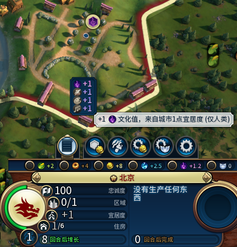

#### 3.1.2.1. 参数: Only 作用于人类/AI

控制相邻**加成的生效对象**，分为人类玩家和AI玩家。

仅支持三个固定字符串，默认值 'Human&AI' ：

* Human&AI：人类和AI均生效（默认值）
* OnlyHuman：仅人类玩家生效
* OnlyAI：仅AI玩家生效

大部分情况下不填这个参数。

### 3.1.3. 示例-学院无条件+1科技值

只是演示参数用的：

```sql
INSERT INTO Ruivo_New_Adjacency 
(ID, 
 DistrictType,        YieldType,        YieldChange,  AdjacencyType, DistrictModifiers, ApplyForUniqueDistricts,  NewMethod) VALUES
('RUIVO_DISTRICT_CAMPUS_YIELD_SCIENCE_FROM_UNCONDITIONAL_BONUS', 
 'DISTRICT_CAMPUS',  'YIELD_SCIENCE',   1,           'FROM_UNCONDITIONAL_BONUS',     1,                       1,  1);
```


#### 3.1.3.1. 参数: NewMethod 是否启用新的方法

选择**区域加成的绑定方式**，分为旧方法和新方法，解决AI建造区域的倾向问题。

布尔值，仅支持 0 或 1 ：

0（旧方法）：加成绑定到 DistrictModifiers 上，**优点**：加成不会因灾难/掠夺消失；**缺点**：AI会降低区域建造倾向，甚至根本不造；

1（新方法）：加成绑定到 TraitModifiers 上（TRAIT_LEADER_MAJOR_CIV），**优点**：AI判断正常，不影响建造倾向；**缺点**：加成会因灾难/掠夺消失，而且卡的要死。

这个参数是有modder告诉我会出现AI不造区域的情况，为此，我写出了一个新方法，可惜的是，新方法过回合非常卡，而且发洪水会让效果消失，所以还是推荐旧方法，这个参数大部分情况下不推荐使用，不填就是了。

（F社你写的什么几把代码，我让你飞起来）

## 3.2. 进阶

### 3.2.1. 示例-娱乐中心从相邻区域获得宜居度加成

从这里开始，我将向你揭示模块化相邻的魅力：

```sql
INSERT INTO Ruivo_New_Adjacency 
(ID, 
 DistrictType,                       ProvideType,    YieldType,         YieldChange,     AdjacencyType,     DistrictModifiers,ApplyForUniqueDistricts) VALUES
('RUIVO_DISTRICT_ENTERTAINMENT_COMPLEX_YIELD_AMENITY_FROM_ADJACENT_DISTRICT', 
 'DISTRICT_ENTERTAINMENT_COMPLEX',  'SelfAmenity',  'YIELD_AMENITY',    0.5,            'FROM_ADJACENT_DISTRICT',           1,                      1);
```


#### 3.2.1.1. 参数: ProvideType 提供类型

定义**加成的提供方式，对应了唯一的一个 ModifierType**，决定加成（如基础产出、百分比系数、住房/宜居度等），**必须与YieldType配套使用！**

参考 Ruivo_ProvideType_YieldType 表，这个表也位于[提供类型-产出类型表](./refer_table-参考表/Ruivo_ProvideType_YieldType.xlsx)

这就是劲爆内容！没错，本mod已经预设了大量的广义加成，此外，这个 ProvideType 是允许自定义的，我们会在后续章节中详细说明。

目前支持的固定提供类型和其加成如下：

```sql
--测试用：圣地获得全部类型产出
INSERT INTO Ruivo_New_Adjacency 
(ID,
DistrictType,           ProvideType, YieldType, YieldChange, AdjacencyType,             DistrictModifiers,  NewMethod,  Only) SELECT
'RUIVO_TEST1_old_' || ProvideType || '_' || YieldType,
'DISTRICT_HOLY_SITE', ProvideType, YieldType, 10,         'FROM_UNCONDITIONAL_BONUS', 1,                  0,         'OnlyHuman'
FROM Ruivo_ProvideType_YieldType;
```

飞机槽位、城市发展速度、区域位、贸易容量、住房、宜居度、忠诚度、影响力、外交点、旅游业绩、电力、6大产出、尤里卡/鼓舞、伟人点、城市单元格魅力、战略资源

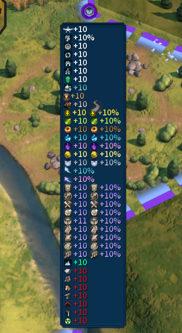

除此之外，本mod还支持property体系，这个我们会在后面的示例中学习到，提供property，以property作为来源，会让这个模组达到惊人的自由度！

### 3.2.2. 示例-工业区从本城“生产力”获得“大工程师点数”加成

工业区从本城的“生产力”获得大工程师点数，注意，YieldType 和 CustomAdjacentObject 要填入的内容取决于其 ProvideType 和 AdjacencyType：

```sql
--工业区从本城的“生产力”获得大工程师点数
INSERT INTO Ruivo_New_Adjacency 
(ID, 
 DistrictType,                 ProvideType,          YieldType,             YieldChange,     AdjacencyType,         CustomAdjacentObject,DistrictModifiers,ApplyForUniqueDistricts) VALUES
('RUIVO_DISTRICT_INDUSTRIAL_ZONE_GREAT_PERSON_CLASS_ENGINEER_FROM_CITY_CAO_YIELD', 
 'DISTRICT_INDUSTRIAL_ZONE',  'GreatPersonPoints',  'GREAT_PERSON_CLASS_ENGINEER',    1,    'FROM_CITY_CAO_YIELD', 'YIELD_PRODUCTION',                   1,                      1);
```

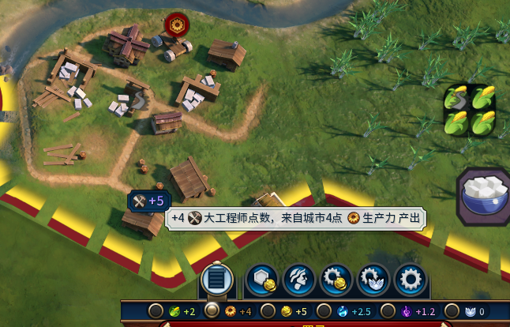

#### 3.2.2.1. 参数: CustomAdjacentObject 指定/自定义相邻对象

为**需要自定义相邻对象的AdjacencyType**指定具体目标，如指定资源类型、资源类别、地形等。

默认值是 'NONE' ，在 Ruivo_AdjacencyType 表也就是[相邻来源类型表](./refer_table-参考表/Ruivo_AdjacencyType.xlsx)中，HasCustomAdjacentObject 为 1 的相邻来源才有必要填 CustomAdjacentObject ，其他的相邻来源不填都没关系。

至于怎么去填 CustomAdjacentObject ，这个需要发挥你的“文明6常识思维”，例如：

* FROM_RINGS_CAO_ROUTE 相邻指定道路类型：从 Routes 表的 RouteType 作为对象，比如 'ROUTE_RAILROAD' 铁路。
* FROM_RINGS_CAO_UNIT 相邻指定单位类型：从 Units 表的 UnitType 作为对象，不过要注意的是，“商人 UNIT_TRADER” 和“间谍 UNIT_SPY” 和其他通常单位不在同一个层级，所以，不能作为对象。
* FROM_RINGS_CAO_RESOURCE 相邻指定资源类型：从 Resources 表的 ResourceType 作为对象，比如'RESOURCE_BANANAS' 香蕉。
* FROM_RINGS_CAO_RESOURCE_CLASS 相邻指定资源类别：指的是资源的“加成资源 RESOURCECLASS_BONUS”，“奢侈资源 RESOURCECLASS_LUXURY”，“战略资源 RESOURCECLASS_STRATEGIC”，“文物资源 RESOURCECLASS_ARTIFACT”四种 ResourceClassType 级别。
* FROM_RINGS_TYPETAG_RESOURCE 相邻资源标签组类别：从 TypeTags 表的资源所对应的 Tag 作为对象，不过这个 Tag 需要在 Tags 表中的类别为 RESOURCE_CLASS ，这是原版所没有的，而且是可拓展的，举个例子：“咖啡资源 RESOURCE_COFFEE” 对应 “节庆女神资源组 CLASS_GODDESS_OF_FESTIVALS”，那么我们可以把 CLASS_GODDESS_OF_FESTIVALS 作为相邻对象，包括咖啡、烟草等资源。不过要注意的是，请务必在 Ruivo_CAO 表中定义这个资源类别的翻译化汉化名称，也就是“LOC_”作为占位符，随后进行翻译。但事实上不通过 Ruivo_CAO 翻译也是可以的，因为你可以直接把 Tag 作为翻译占位符，C大佬的[“海洋区域拓展”](https://steamcommunity.com/sharedfiles/filedetails/?id=3668683945)便是这么做的。
* FROM_RINGS_CAO_IMPROVEMENT 相邻指定改良类型：从 Improvements 表的 ImprovementType 作为对象，比如 'IMPROVEMENT_FARM' 农田。
* FROM_RINGS_CAO_DISTRICT 相邻指定区域类型：从 Districts 表的 DistrictType 作为对象，比如 'DISTRICT_CAMPUS' 学院。
* FROM_RINGS_CAO_FEATURE 相邻指定地貌类型：从 Features 表的 FeatureType 作为对象，比如 'FEATURE_FOREST' 森林。
* FROM_RINGS_CAO_TERRAIN 相邻指定地形类型：从 Terrains 表的 TerrainType 作为对象，比如 'TERRAIN_DESERT' 沙漠平原。
* FROM_RINGS_CAO_TERRAIN_SETS 相邻指定地形函数：这个是我通过lua函数实现的判断，需要从 Ruivo_CAO 表找到可支持的函数，比如 'IsMountain' 就对应了所有的山脉类型组。

除此之外，property 系的相邻来源的 CustomAdjacentObject 应该填写你需要的 property key 的名称，然后诸如 yield 6大产出一类的就填 yield 即可。

### 3.2.3. 示例-保护区从相邻2环国家公园获得住房加成

```sql
--保护区从相邻2环内的国家公园获得“住房加成”
INSERT INTO Ruivo_New_Adjacency 
(ID, 
 DistrictType,           ProvideType,   YieldType,      YieldChange,    AdjacencyType,              Rings,  DistrictModifiers, ApplyForUniqueDistricts) VALUES
('RUIVO_DISTRICT_PRESERVE_YIELD_HOUSING_FROM_RINGS_NATIONALPARK', 
 'DISTRICT_PRESERVE',   'SelfHousing', 'YIELD_HOUSING', 1,             'FROM_RINGS_NATIONALPARK',       2,                  1,                       1);
```

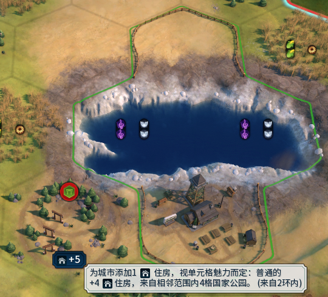

#### 3.2.3.1. 参数: Rings 多环相邻

定义**相邻加成的环数**，仅对带有 RINGS 标识的 AdjacencyType 生效。

0：仅检测**区域所在的本格单元格**，不检测相邻单元格；

≥1：检测**不包含本格**的指定环数内的单元格/区域，默认值为1（1环相邻）。

非RINGS类型的 AdjacencyType 会忽略此参数，即使填写也无效果，保持默认值1即可。

### 3.2.4. 示例-港口从相邻3环“金币类资源”获得金币加成

```sql
--港口从相邻3环内的金币类资源获得“金币加成”
INSERT INTO Ruivo_New_Adjacency 
(ID, 
 DistrictType,          ProvideType,   YieldType,       YieldChange,    AdjacencyType,            CustomAdjacentObject,  Rings,  DistrictModifiers, ApplyForUniqueDistricts) VALUES
('RUIVO_DISTRICT_HARBOR_YIELD_GOLD_FROM_RINGS_TYPETAG_RESOURCE', 
 'DISTRICT_HARBOR',    'SelfBonus',   'YIELD_GOLD',     1,             'FROM_RINGS_TYPETAG_RESOURCE',     'CLASS_GOLD',  3,                      1,                       1);
```

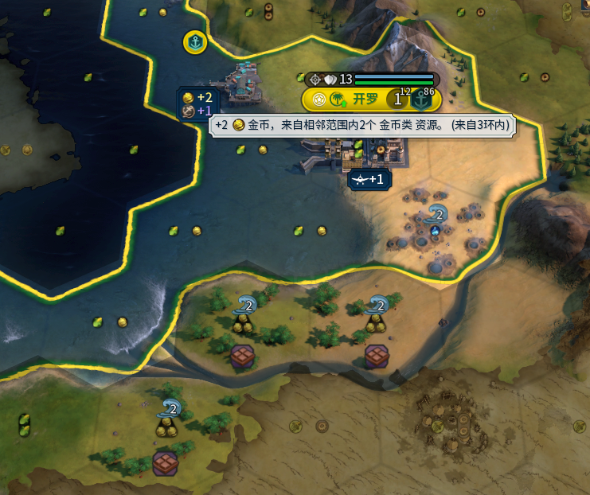

### 3.2.5. 示例-剧院从相邻2环内的奢侈资源获得金币加成（寻欢作乐的凯瑟琳）

第一种写法，注意这里 DistrictModifiers 填0：

```sql
--剧院从相邻2环内的奢侈资源获得金币加成（寻欢作乐的凯瑟琳）
INSERT INTO Ruivo_New_Adjacency 
(ID, 
 DistrictType,          ProvideType,   YieldType,       YieldChange,    AdjacencyType,                   CustomAdjacentObject,  Rings,  DistrictModifiers, ApplyForUniqueDistricts,  TraitType) VALUES
('RUIVO_DISTRICT_THEATER_YIELD_GOLD_FROM_RINGS_CAO_RESOURCE_CLASS_1', 
 'DISTRICT_THEATER',   'SelfBonus',   'YIELD_GOLD',     1,             'FROM_RINGS_CAO_RESOURCE_CLASS', 'RESOURCECLASS_LUXURY',     2,                  0,                       1, 'TRAIT_LEADER_MAGNIFICENCES');
```

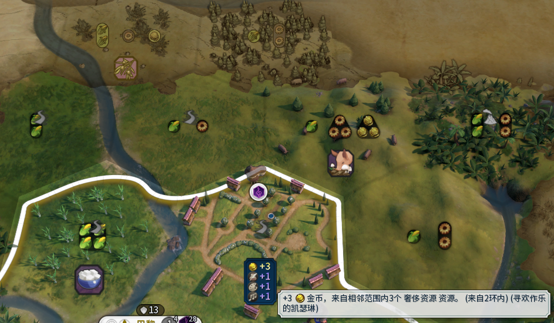

#### 3.2.5.1. 参数: TraitType 特质

将相邻加成**绑定到指定的特质**（文明/领袖特质），仅当特质生效时，加成才有效。

默认值 NULL；自定义值：填写游戏 Traits 表中的 TraitType 特质类型。

此参数**已基本被ModifierOwner替代**，除非你想把特质和其他来源叠加使用；若填写此参数，必须将 DistrictModifiers 设为0，否则无效。

### 3.2.6. 示例-剧院从相邻2环内的奢侈资源获得金币加成（寻欢作乐的凯瑟琳）

第二种写法，注意这里 DistrictModifiers 填1：

```sql
--剧院从相邻2环内的奢侈资源获得金币加成（寻欢作乐的凯瑟琳）
INSERT INTO Ruivo_New_Adjacency 
(ID, 
 DistrictType,          ProvideType,   YieldType,       YieldChange,    AdjacencyType,                   CustomAdjacentObject,  Rings,  DistrictModifiers, ApplyForUniqueDistricts, ModifierOwner, WhoIsTheOwner, CollectionType) VALUES
('RUIVO_DISTRICT_THEATER_YIELD_GOLD_FROM_RINGS_CAO_RESOURCE_CLASS_2', 
 'DISTRICT_THEATER',   'SelfBonus',   'YIELD_GOLD',     1,             'FROM_RINGS_CAO_RESOURCE_CLASS', 'RESOURCECLASS_LUXURY',     2,                  1,                       1, 'TraitModifiers', 'TRAIT_LEADER_MAGNIFICENCES', 'COLLECTION_PLAYER_DISTRICTS');
```

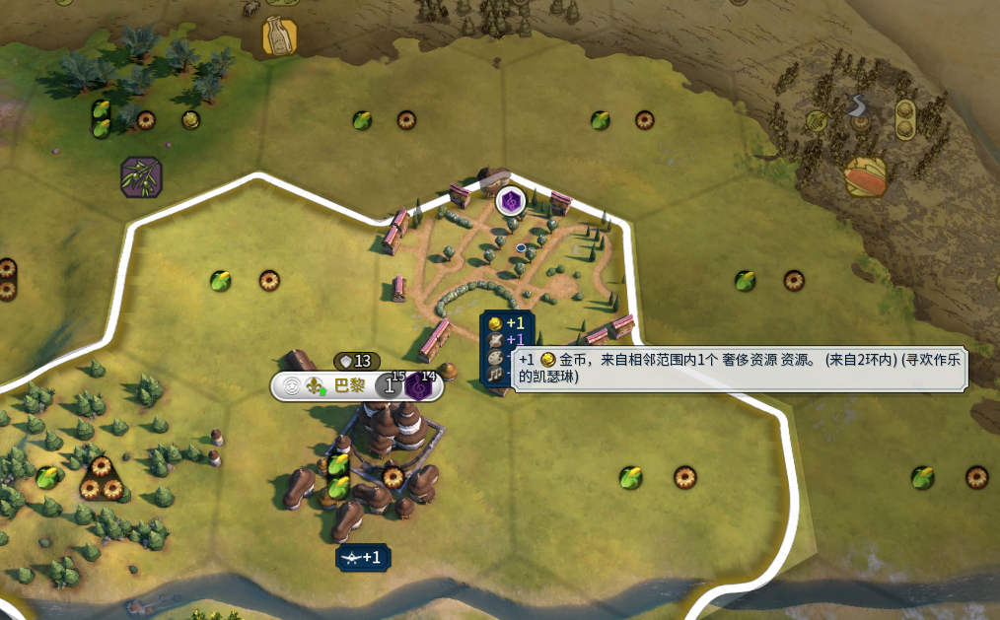

#### 3.2.6.1. 参数: ModifierOwner 相邻加成发起者

定义**加成Modifier的发起者**，即加成由「什么对象」触发（如区域、科技、建筑、政策卡）。参考模组 Ruivo_ModifierOwner_CollectionType 表，

注意，总督升级系列暂时有bug（2026.4.11）

| ModifierOwner              | WhoIsTheOwner         | CollectionType              | Tooltip                                                                                                        |
| -------------------------- | --------------------- | --------------------------- | -------------------------------------------------------------------------------------------------------------- |
| DistrictModifiers          | NULL                  | COLLECTION_PLAYER_DISTRICTS | 区域作为发起者，这个不需要填后面两个参数，直接用默认值即可                                                     |
| TraitModifiers             | TraitType             | COLLECTION_PLAYER_DISTRICTS | 玩家特质作用于玩家全部区域，请去 Traits 表里找                                                                 |
| BuildingModifiers          | BuildingType          | COLLECTION_CITY_DISTRICTS   | 建筑作用于所属城市的区域，请去 Buildings 表里找                                                                |
| BuildingModifiers          | BuildingType          | COLLECTION_PLAYER_DISTRICTS | 建筑作用于玩家全部区域，通常可能会用在奇观上，建筑参数同样请去 Buildings 表里找                                |
| PolicyModifiers            | PolicyType            | COLLECTION_PLAYER_DISTRICTS | 政策卡作用于玩家全部区域，请去 Policies 表里找                                                                 |
| TechnologyModifiers        | TechnologyType        | COLLECTION_PLAYER_DISTRICTS | 科技作用于玩家全部区域，请去 Technologies 表里找                                                               |
| CivicModifiers             | CivicType             | COLLECTION_PLAYER_DISTRICTS | 市政作用于玩家全部区域，请去 Civics 表里找                                                                     |
| GovernmentModifiers        | GovernmentType        | COLLECTION_PLAYER_DISTRICTS | 政体作用于玩家全部区域，请去 Governments 表里找                                                                |
| BeliefModifiers            | BeliefType            | COLLECTION_ALL_DISTRICTS    | 信仰（万神殿、信条）是作用于全部区域的，因为信仰是没有所有者对象的，只会因为req而产生效果，请去 Beliefs 表里找 |
| GovernorPromotionModifiers | GovernorPromotionType | COLLECTION_CITY_DISTRICTS   | 总督升级作用于所属城市区域，请去 GovernorPromotions 表里找                                                     |
| GovernorPromotionModifiers | GovernorPromotionType | COLLECTION_PLAYER_DISTRICTS | 总督升级作用于玩家所有区域，请去 GovernorPromotions 表里找                                                     |

#### 3.2.6.2. 参数: WhoIsTheOwner 发起对象

定义**Modifier发起者的具体对象**，即哪个科技/建筑/政策卡触发加成，与 ModifierOwner 强绑定。

#### 3.2.6.3. 参数: CollectionType 作用范围

定义**加成Modifier的作用对象集合**，即加成作用于哪些区域级别：城市/玩家。参考模组 Ruivo_ModifierOwner_CollectionType 表，核心常用值如下：

| CollectionType              | 作用对象           | 适用场景                  |
| --------------------------- | ------------------ | ------------------------- |
| COLLECTION_PLAYER_DISTRICTS | 玩家的所有区域     | 常规区域加成（默认值）    |
| COLLECTION_CITY_DISTRICTS   | 某城市的所有区域   | 建筑/总督触发的城市内加成 |
| COLLECTION_ALL_DISTRICTS    | 所有文明的所有区域 | 信仰/万神殿触发的全局加成 |

## 3.3. 自定义

从本节开始，我们需要操作的表便不止于 Ruivo_New_Adjacency

### 3.3.1. 示例-修改浮动文本-学院从2环内每座山脉+0.3大科学家点数

实际上，每个ID对应的浮动文本是可以修改的，实际上是替换：

```sql
--学院从2环内每座山脉+0.3大科学家点数
INSERT INTO Ruivo_New_Adjacency 
(ID, 
 DistrictType,          ProvideType,         YieldType,             YieldChange,     AdjacencyType,            CustomAdjacentObject,  Rings,  DistrictModifiers, ApplyForUniqueDistricts) VALUES
('RUIVO_DISTRICT_CAMPUS_GREAT_PERSON_CLASS_SCIENTIST_FROM_RINGS_CAO_TERRAIN_SETS', 
 'DISTRICT_CAMPUS',    'GreatPersonPoints', 'GREAT_PERSON_CLASS_SCIENTIST', 0.3,    'FROM_RINGS_CAO_TERRAIN_SETS',     'IsMountain',  2,                      1,                       1);

--替换文本
INSERT INTO Ruivo_New_Adjacency_Text (ID, Tooltip, AddPercentChar)
VALUES
('RUIVO_DISTRICT_CAMPUS_GREAT_PERSON_CLASS_SCIENTIST_FROM_RINGS_CAO_TERRAIN_SETS',      'LOC_RUIVO_TEST_TOOLTIP', 1);
```

然后我们需要进行占位符的翻译：

```xml
<GameData>
    <LocalizedText>
        <Row Tag="LOC_RUIVO_TEST_TOOLTIP" Language="zh_Hans_CN">
            <Text>这就是模块化相邻！+{1_iBonus} {2_YieldIcon}，来自相邻范围内{3_AdjacentSubjectNum}个 {4_CAO}。可惜的是参数的先后顺序不能改</Text>
        </Row>
    </LocalizedText>
</GameData>
```

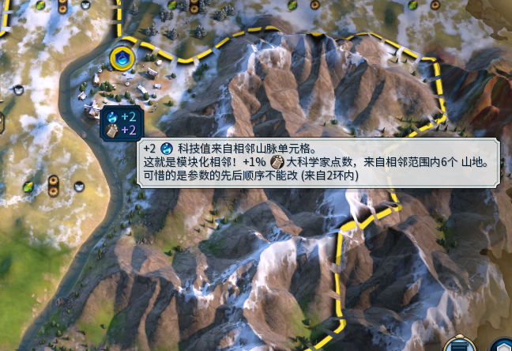

#### 3.3.1.1. 数据表:  Ruivo_New_Adjacency_Text 浮动文本替换表

为核心表的每条加成规则配置UI提示文本，让玩家在游戏中看到加成的说明。

```sql
INSERT INTO Ruivo_New_Adjacency_Text (ID, Tooltip, AddPercentChar) VALUES
('核心表的ID', '文本Key', 0/1);
```

+ ID：与 Ruivo_New_Adjacency 的ID一致，实现替换；
+ Tooltip：自定义文本占位符，需在游戏文本表中配置对应的中文/英文文本；
+ AddPercentChar：是否在数值后加百分比符号，0=不加，1=加（但是这个只会在浮动文本里修改，而且你完全可以自己实现一次修改，大部分时候不填即可）。

  然后再去注册文本即可，大部分情况下只有三个参数，有自定义相邻对象时才有第四个，注意，顺序不能变，但是参数可以少：
+ {1_iBonus}：加成数
+ {2_YieldIcon}：加成图标与名称
+ {3_AdjacentSubjectNum}：相邻对象数量
+ {4_CAO}：自定义相邻对象

### 3.3.2. 示例-定义自定义对象-娱乐中心从自定义tag类别资源获得宜居度加成

我们使用定义资源组tag的方法：

```sql
--定义资源类：RUIVO_TEST
INSERT INTO Tags 
(Tag,                  Vocabulary) VALUES  
('CLASS_RUIVO_TEST',   'RESOURCE_CLASS');

--定义资源标签：香蕉、玉、铁
INSERT INTO TypeTags 
(Tag,                 Type) VALUES  
('CLASS_RUIVO_TEST', 'RESOURCE_BANANAS'),
('CLASS_RUIVO_TEST', 'RESOURCE_JADE'),
('CLASS_RUIVO_TEST', 'RESOURCE_IRON');

--娱乐中心从自定义tag类别资源获得宜居度加成
INSERT INTO Ruivo_New_Adjacency 
(ID, 
 DistrictType,                        ProvideType,    YieldType,       YieldChange,    AdjacencyType,              CustomAdjacentObject,     Rings,  DistrictModifiers, ApplyForUniqueDistricts) VALUES
('RUIVO_DISTRICT_ENTERTAINMENT_COMPLEX_YIELD_AMENITY_FROM_RINGS_TYPETAG_RESOURCE', 
 'DISTRICT_ENTERTAINMENT_COMPLEX',   'SelfAmenity',  'YIELD_AMENITY',  1,             'FROM_RINGS_TYPETAG_RESOURCE', 'CLASS_RUIVO_TEST',     2,                      1,                       1);

--替换文本占位符
INSERT INTO Ruivo_CAO 
(CustomAdjacentObject, Name)VALUES 
('CLASS_RUIVO_TEST', 'LOC_RUIVO_CLASS_TEST_RESOURCE');
```

然后是翻译：

```xml
<GameData>
    <LocalizedText>
		<Row Tag="LOC_RUIVO_CLASS_TEST_RESOURCE" Language="zh_Hans_CN">
			<Text>测试资源</Text>
		</Row>
    </LocalizedText>
</GameData>
```

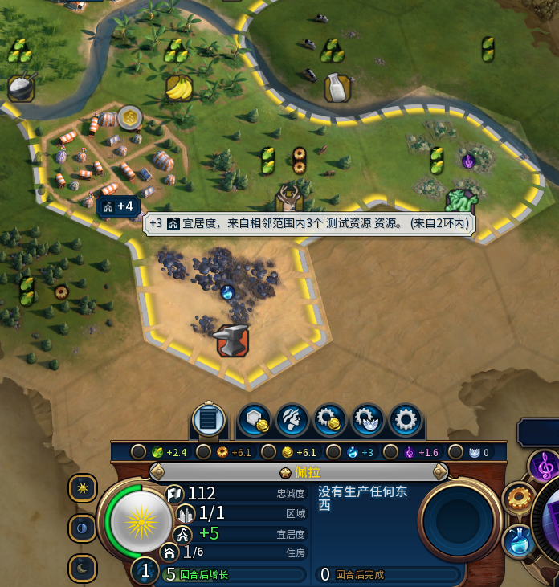

#### 3.3.2.1. 数据表: Ruivo_CAO 自定义相邻对象文本替换表

大概长这样：

```sql
INSERT INTO Ruivo_CAO (CustomAdjacentObject, Name) VALUES
        --资源class
        ("RESOURCECLASS_BONUS",       "LOC_RUIVO_RESOURCECLASS_BONUS"),
        ("RESOURCECLASS_LUXURY",      "LOC_RUIVO_RESOURCECLASS_LUXURY"),
        ("RESOURCECLASS_STRATEGIC",   "LOC_RUIVO_RESOURCECLASS_STRATEGIC"),
        ("RESOURCECLASS_ARTIFACT",    "LOC_RUIVO_RESOURCECLASS_ARTIFACT"),

        --资源tag
        ("CLASS_FOOD",                "LOC_RUIVO_CLASS_FOOD"),
        ("CLASS_CULTURE",             "LOC_RUIVO_CLASS_CULTURE"),
        ("CLASS_GOLD",                "LOC_RUIVO_CLASS_GOLD"),
        ("CLASS_PRODUCTION",          "LOC_RUIVO_CLASS_PRODUCTION"),
        ("CLASS_SCIENCE",             "LOC_RUIVO_CLASS_SCIENCE"),
        ("CLASS_ORAL_TRADITION",      "LOC_RUIVO_CLASS_ORAL_TRADITION"),
        ("CLASS_GODDESS_OF_FESTIVALS","LOC_RUIVO_CLASS_GODDESS_OF_FESTIVALS"),
        ("CLASS_SEA",                 "LOC_RUIVO_CLASS_SEA"),

        --地形函数
        ("IsMountain",       "LOC_RUIVO_ISMOUNTAIN"),
        ("IsHills",          "LOC_RUIVO_ISHILLS"),
        ("IsFlatlands",      "LOC_RUIVO_ISFLATLANDS"),
        ("IsWater",          "LOC_RUIVO_ISWATER"),
        ("IsShallowWater",   "LOC_RUIVO_ISSHALLOWWATER"),
        ("IsLake",           "LOC_RUIVO_ISLAKE"),
        ("IsCanyon",         "LOC_RUIVO_ISCANYON"),
        ("IsCoastalLand",    "LOC_RUIVO_ISCOASTALLAND"),
        ("IsRiverCrossing",  "LOC_RUIVO_ISRIVERCROSSING"),
        ("IsOpenGround",     "LOC_RUIVO_ISOPENGROUND"),
        ("IsRoughGround",    "LOC_RUIVO_ISROUGHGROUND");
```

* CustomAdjacentObject：自定义相邻对象
* Name：文本占位符

实际上这个表没多大用，你完全可以通过前面那个Tooltip修改来实现。

### 3.3.3. 示例-自定义产出类型-[医疗区](https://steamcommunity.com/sharedfiles/filedetails/?id=3483460357)提供治疗光环

使用例代码来自[增强医疗区](https://steamcommunity.com/sharedfiles/filedetails/?id=3656529825)，其他参数的填法请参考前文，这里的填法并不标准，只是演示自定义产出类型而已，而且注意，本模组实际上是把UI显示和实际生效分开的，也就是显示归显示，生效归生效。

注意，这里的提供类型并非property，但是仍然是以property作为lua函数触发的数值量，这是因为本模组本身就是靠单元格的property实现的效果，所以单元格自带property，想通过property作为函数数值既可以直接用 FreeCompose 参数，也可以直接使用 SelfDistrictProperty、SelfCityProperty、SelfPlayerProperty、SelfGameProperty 这四个 ProvideType，在后面的例子里我们将进行详细的教程。

```sql
-- 治疗光环产出类型的名称、图标、字体颜色
    INSERT INTO Ruivo_Yield_IconString (YieldType, Name, IconString, TextColor, AddPercentChar) VALUES
    ("HealRings", "LOC_RUIVO_HealRings", "[ICON_DAMAGED]", "[COLOR_GREEN]", 0);

-- 医疗区释放治疗光环
-- 医疗区基础产出：治疗光环+7
-- 每个在岗公民产出：治疗光环+10
    INSERT INTO Ruivo_New_Adjacency 
    (ID, DistrictType,                                      -->ID和区域（注意，一定要以区域为主体，ID是主键，不要重复）
    ProvideType, YieldType, YieldChange,                    -->提供的产出分类、产出类型、产出量（产出类型一定要严格对应产出分类，比如商路对应商路大类）
    AdjacencyType, CustomAdjacentObject,                    -->相邻类型、自定义指定相邻目标（指定相邻目标依赖于相邻类型）
    DistrictModifiers, ApplyForUniqueDistricts, TraitType,  -->是否为区域通用（0/1） 是否应用于特色区域（0/1） 是否来自于特质（填1时前面的DistrictModifiers填0）  
    ModifierOwner, WhoIsTheOwner, CollectionType,           -->实际来源类型、来源目标、作用目标
    Only,                                                   -->是否为人类/AI独享
    FreeCompose)                                            -->自由组装模式
    VALUES 
    ('R_DISTRICT_JD_HOSPITAL', 'DISTRICT_JD_HOSPITAL', 
    'ShowFreeComposeYield', 'HealRings', 10, 
    'FROM_SELF_WORKER', 'NONE', 
    1, 1, NULL, 
    'DistrictModifiers', NULL, 'COLLECTION_CITY_DISTRICTS', 
    'Human&AI', 
    1),

    ('R_DISTRICT_JD_HOSPITAL_BASIC', 'DISTRICT_JD_HOSPITAL', 
    'ShowFreeComposeYield', 'HealRings', 7, 
    'FROM_UNCONDITIONAL_BONUS', 'NONE', 
    1, 1, NULL, 
    'DistrictModifiers', NULL, 'COLLECTION_CITY_DISTRICTS', 
    'Human&AI', 
    1);
```

以及翻译：

```xml
<GameData>
	<LocalizedText>
		<Row Tag="LOC_RUIVO_HealRings" Language="zh_Hans_CN">
			<Text>治疗光环治疗量</Text>
		</Row>
	</LocalizedText>
</GameData>
```

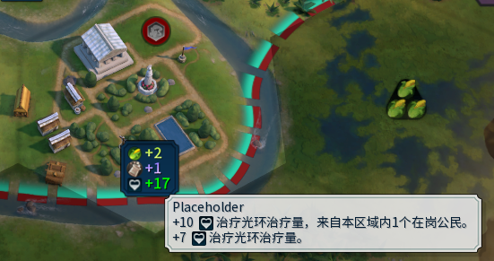

#### 3.3.3.1. 数据表: Ruivo_Yield_IconString 自定义产出显示表

为自定义 YieldType 配置UI显示效果，包括产出图标、名称、字体颜色、是否加百分比符号。

```sql
INSERT INTO Ruivo_Yield_IconString (YieldType, Name, IconString, TextColor, AddPercentChar) VALUES
('自定义YieldType', '名称Key', '图标字符串', '颜色值', 0/1);
```

+ YieldType：与核心表自定义的 YieldType 一致
+ Name：产出名称的文本占位符
+ IconString：游戏内置图标占位符，你也可以自己去加载个 icon 定义到 IconDefinitions 即可，这里就不细讲了
+ TextColor：字体颜色，支持游戏内置颜色 [COLOR_GREEN]（绿色）或自定义 RGB [COLOR:255,255,255,255]
+ AddPercentChar：是否加百分比符号

### 3.3.4. 示例-自定义提供类型-[轻工业区](https://steamcommunity.com/sharedfiles/filedetails/?id=3489161598)获得建造者和商人生产加速

注意，我们多了一个新参数叫做 CustomArgumentValue，因为可能会存在一个同名的 ArgumentName 有多种用途，比如单元格生产力？城市生产力？总不能拿同一个YILED_PRODUCTION 去对应多个吧，所以只能多加个 CustomArgumentValue 和 YieldType 区别开了：

```sql
--定义提供类型：单位建造加速--填了ArgumentName后，yieldType会被自动填上
    INSERT INTO Ruivo_New_Adjacency_ProvideType (ProvideType, ModifierType, ArgumentName) VALUES
    ('SelfUnitProduction', 'MODIFIER_PLAYER_UNITS_ADJUST_UNIT_PRODUCTION', 'UnitType');

--定义产出类型：商人加速和建造者加速
    INSERT INTO Ruivo_Yield_IconString (YieldType, Name, IconString, TextColor, AddPercentChar) VALUES
    ('UNIT_BUILDER_ACCELERATION', 'LOC_RUIVO_UNIT_BUILDER_ACCELERATION', '[ICON_PRODUCTION]', '[COLOR:255,126,0,255]', 1),
    ('UNIT_TRADER_ACCELERATION',  'LOC_RUIVO_UNIT_TRADER_ACCELERATION',  '[ICON_PRODUCTION]', '[COLOR:255,252,0,255]', 1);

--轻工业区+100%商人和建造者加速
    INSERT INTO Ruivo_New_Adjacency 
    (ID, 
     DistrictType,                     ProvideType,          YieldType,                      CustomArgumentValue,   YieldChange, AdjacencyType,   DistrictModifiers,  ApplyForUniqueDistricts) VALUES
    ('RUIVO_DISTRICT_LIGHT_INDUSTRIAL_ZONE_UNIT_BUILDER_ACCELERATION_FROM_ADJACENT_DISTRICT',  
    'DISTRICT_LIGHT_INDUSTRIAL_ZONE', 'SelfUnitProduction', 'UNIT_BUILDER_ACCELERATION',    'UNIT_BUILDER',         100,        'FROM_ADJACENT_DISTRICT',         1,                        1),
    ('RUIVO_DISTRICT_LIGHT_INDUSTRIAL_ZONE_UNIT_TRADER_ACCELERATION_FROM_ADJACENT_DISTRICT',  
    'DISTRICT_LIGHT_INDUSTRIAL_ZONE', 'SelfUnitProduction', 'UNIT_TRADER_ACCELERATION',     'UNIT_TRADER',          100,        'FROM_ADJACENT_DISTRICT',         1,                        1);
```

以及翻译

```xml
<GameData>
	<LocalizedText>
		<Row Tag="LOC_RUIVO_UNIT_BUILDER_ACCELERATION" Language="zh_Hans_CN">
			<Text>建造者加速</Text>
		</Row>
		<Row Tag="LOC_RUIVO_UNIT_TRADER_ACCELERATION" Language="zh_Hans_CN">
			<Text>商人加速</Text>
		</Row>
	</LocalizedText>
</GameData>
```

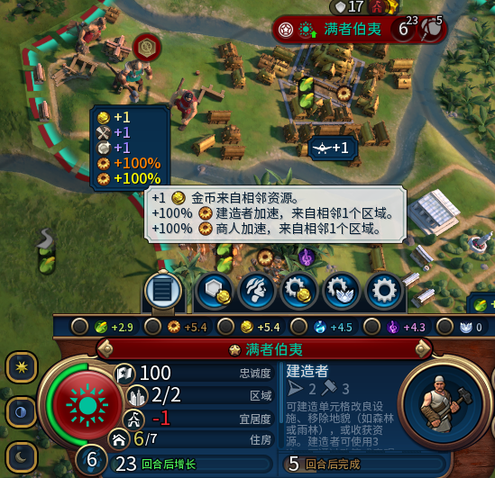

#### 3.3.4.1. 数据表:  Ruivo_New_Adjacency_ProvideType

自定义一种新的提供类型，并且附带其所能产生的modifier的效果。

```sql
INSERT INTO Ruivo_New_Adjacency_ProvideType (ProvideType, ModifierType, ArgumentName) VALUES
('自定义提供类型ProvideType', '这个提供类型生效的ModifierType', '额外的指定参数名称');
```

* ProvideType：自定义提供类型
* ModifierType：修改器效果，注意，因为是挂载在区域上的，区域具有“单元格”“所属城市”“所属玩家”的属性，你的 COLLECTION 作用范围也应当有这些属性的基础
* ArgumentName：用于在需要向 ModifierArguments 表里加特别字段时使用，正常情况下基本都是填的 amount，所以完全不需要管这个参数，填写字段时自动把 CustomArgumentValue 参数填进去的，所以你只需要明确这里是个什么 ArgumentName 即可，虽然目前我只支持一个，但是应该也够了

#### 3.3.4.2. 参数：CustomArgumentValue 自定义ModifierType的值

实际上这个是我的屎山代码的产物，为了和UI显示做到兼容，只能出此下策了，也就是说在设计非预设产出的情况下，非property体系的情况下， modifierType 有除了数量 amount 以外的参数的情况下，你需要额外再把真正的目标写到这，区别于 YieldType。

我举个例子，我们可以在 Ruivo_Yield_IconString表中定义出建造者加速 UNIT_BUILDER_ACCELERATION 这个新的产出，但是我们在填主表 Ruivo_New_Adjacency 的时候还是得要再写一次 UNIT_BUILDER，比较 UNIT_BUILDER_ACCELERATION 并不是一种 UnitType 单位类型。

### 3.3.5. 示例-自由组装模式-港口提供捕捞范围

比较复杂的自由组装模式的示例：

```sql
--============================================================================================================================
--港口：本城每有一个区域，捕捞范围+1环，捕捞范围内的浅海和深海单元格+2金币
    --自定义捕捞范围这个产出类型的图标和文本和颜色
    INSERT INTO Ruivo_Yield_IconString (YieldType, Name, IconString, TextColor) VALUES
    ("FishingRange", "LOC_RUIVO_FishingRange", "[ICON_DISTRICT_HARBOR]", "[COLOR:MarineDark]");

    -- 最高10环
    CREATE TABLE Ruivo_RingList (Num INTEGER PRIMARY KEY);
    INSERT INTO Ruivo_RingList (Num) VALUES (1), (2), (3), (4), (5), (6), (7), (8), (9), (10);

    --自由组装模式
    INSERT INTO Ruivo_New_Adjacency
    (ID,                                                          DistrictType,      YieldType,    ProvideType,             YieldChange, AdjacencyType,            DistrictModifiers, FreeCompose)  VALUES 
    ('RUIVO_DISTRICT_HARBOR_YIELD_GOLD_FROM_CITY_DISTRICTS_NUM', 'DISTRICT_HARBOR', 'FishingRange', 'ShowFreeComposeYield',   1,          'FROM_CITY_DISTRICTS_NUM', 1,                 1);

    -- 区域贴给玩家单元格
    INSERT INTO DistrictModifiers (DistrictType, ModifierId) 
    SELECT "DISTRICT_HARBOR", 'LONG_RANGE_FISHING_DISTRICT_HARBOR' || '_' || ListB.Num FROM Ruivo_RingList ListB;

        -- 区域满足本城区域总数，单元格满足相邻区域
            INSERT INTO Modifiers (ModifierId, ModifierType, OwnerRequirementSetId, SubjectRequirementSetId) 
            SELECT 'LONG_RANGE_FISHING_DISTRICT_HARBOR' || '_' || ListB.Num, 
                "MODIFIER_PLAYER_ADJUST_PLOT_YIELD", 
                'REQUIREMENT_' || 'LONG_RANGE_FISHING_DISTRICT_HARBOR' || '_' || ListB.Num,
                'REQUIREMENT_' || 'RUIVO_ADJACENT_TO_OWNER' || '_' || ListB.Num
            FROM Ruivo_RingList ListB;

            INSERT INTO ModifierArguments (ModifierId, Name, Value)
            SELECT 'LONG_RANGE_FISHING_DISTRICT_HARBOR' || '_' || ListB.Num, 
                "Amount", 
                2
            FROM Ruivo_RingList ListB
            UNION
            SELECT 'LONG_RANGE_FISHING_DISTRICT_HARBOR' || '_' || ListB.Num, 
                "YieldType", 
                "YIELD_GOLD"
            FROM Ruivo_RingList ListB;

        --REQ部分：本城区域总数--只能用十进制
            INSERT INTO RequirementSets (RequirementSetId,                      RequirementSetType)
            SELECT          'REQUIREMENT_' || 'LONG_RANGE_FISHING_DISTRICT_HARBOR' || '_' || ListB.Num,    'REQUIREMENTSET_TEST_ALL'                         	FROM Ruivo_RingList ListB;

            INSERT INTO RequirementSetRequirements (RequirementSetId,           RequirementId)
            SELECT          'REQUIREMENT_' || 'LONG_RANGE_FISHING_DISTRICT_HARBOR' || '_' || ListB.Num,    'REQUIRES_' || 'LONG_RANGE_FISHING_DISTRICT_HARBOR' || '_' || ListB.Num     		FROM Ruivo_RingList ListB;

            INSERT INTO Requirements (RequirementId,                            RequirementType)
            SELECT          'REQUIRES_' || 'LONG_RANGE_FISHING_DISTRICT_HARBOR' || '_' || ListB.Num,       'REQUIREMENT_PLOT_PROPERTY_MATCHES'                  FROM Ruivo_RingList ListB;

            INSERT INTO RequirementArguments (RequirementId,                    Name,                 Value)
            SELECT          'REQUIRES_' || 'LONG_RANGE_FISHING_DISTRICT_HARBOR' || '_' || ListB.Num,       'PropertyName',       'RUIVO_DISTRICT_HARBOR_YIELD_GOLD_FROM_CITY_DISTRICTS_NUM'||'_TOTAL'   FROM Ruivo_RingList ListB
            UNION SELECT    'REQUIRES_' || 'LONG_RANGE_FISHING_DISTRICT_HARBOR' || '_' || ListB.Num,       'PropertyMinimum',    ListB.Num                          	FROM Ruivo_RingList ListB;

        --通用的req：
        --REQ部分：对应环数
            INSERT INTO RequirementSets (RequirementSetId,                      RequirementSetType)
            SELECT          'REQUIREMENT_' || 'RUIVO_ADJACENT_TO_OWNER' || '_' || ListB.Num,    'REQUIREMENTSET_TEST_ALL'                         	FROM Ruivo_RingList ListB;

            INSERT INTO RequirementSetRequirements (RequirementSetId,           RequirementId)
            SELECT          'REQUIREMENT_' || 'RUIVO_ADJACENT_TO_OWNER' || '_' || ListB.Num,    'REQUIRES_' || 'RUIVO_ADJACENT_TO_OWNER' || '_' || ListB.Num     		FROM Ruivo_RingList ListB
            UNION SELECT    'REQUIREMENT_' || 'RUIVO_ADJACENT_TO_OWNER' || '_' || ListB.Num,    'REQUIRES_PLOT_IS_COAST_OR_OCEAN_RUIVO'                          	    FROM Ruivo_RingList ListB;

            INSERT INTO Requirements (RequirementId,                            RequirementType)
            SELECT          'REQUIRES_' || 'RUIVO_ADJACENT_TO_OWNER' || '_' || ListB.Num,       'REQUIREMENT_PLOT_ADJACENT_TO_OWNER'                  FROM Ruivo_RingList ListB;

            INSERT INTO RequirementArguments (RequirementId,                    Name,                 Value)
            SELECT          'REQUIRES_' || 'RUIVO_ADJACENT_TO_OWNER' || '_' || ListB.Num,       'MaxDistance',      ListB.Num   FROM Ruivo_RingList ListB
            UNION SELECT    'REQUIRES_' || 'RUIVO_ADJACENT_TO_OWNER' || '_' || ListB.Num,       'MinDistance',      ListB.Num   FROM Ruivo_RingList ListB;
        --REQ部分：湖泊海岸或者海洋单元格
            insert or ignore into RequirementSets (RequirementSetId,		RequirementSetType) values
                ('REQUIREMENTS_PLOT_IS_COAST_OR_OCEAN_RUIVO',				'REQUIREMENTSET_TEST_ANY');

            insert or ignore into RequirementSetRequirements
                (RequirementSetId,											RequirementId)
            values
                ('REQUIREMENTS_PLOT_IS_COAST_OR_OCEAN_RUIVO',				'REQUIRES_TERRAIN_COAST'),
                ('REQUIREMENTS_PLOT_IS_COAST_OR_OCEAN_RUIVO',				'REQUIRES_TERRAIN_OCEAN');

            insert or ignore into Requirements (RequirementId,		        RequirementType) values
                ('REQUIRES_PLOT_IS_COAST_OR_OCEAN_RUIVO',			        'REQUIREMENT_REQUIREMENTSET_IS_MET');

            insert or ignore into RequirementArguments (RequirementId,		Name,		Value) values
                ('REQUIRES_PLOT_IS_COAST_OR_OCEAN_RUIVO',			        'RequirementSetId',	'REQUIREMENTS_PLOT_IS_COAST_OR_OCEAN_RUIVO');
--============================================================================================================================
--港口：特色区域兼容
    -- 区域贴给玩家单元格
    INSERT INTO DistrictModifiers (DistrictType, ModifierId) 
    SELECT DR.CivUniqueDistrictType, 'LONG_RANGE_FISHING_' || DR.CivUniqueDistrictType || '_' || ListB.Num FROM Ruivo_RingList ListB JOIN DistrictReplaces DR ON DR.ReplacesDistrictType = 'DISTRICT_HARBOR';

        -- 区域满足本城区域总数，单元格满足相邻区域
            INSERT INTO Modifiers (ModifierId, ModifierType, OwnerRequirementSetId, SubjectRequirementSetId) 
            SELECT 'LONG_RANGE_FISHING_' || DR.CivUniqueDistrictType || '_' || ListB.Num, 
                "MODIFIER_PLAYER_ADJUST_PLOT_YIELD", 
                'REQUIREMENT_' || 'LONG_RANGE_FISHING_' || DR.CivUniqueDistrictType || '_' || ListB.Num,
                'REQUIREMENT_' || 'RUIVO_ADJACENT_TO_OWNER' || '_' || ListB.Num
            FROM Ruivo_RingList ListB JOIN DistrictReplaces DR ON DR.ReplacesDistrictType = 'DISTRICT_HARBOR';

            INSERT INTO ModifierArguments (ModifierId, Name, Value)
            SELECT 'LONG_RANGE_FISHING_' || DR.CivUniqueDistrictType || '_' || ListB.Num, 
                "Amount", 
                2
            FROM Ruivo_RingList ListB JOIN DistrictReplaces DR ON DR.ReplacesDistrictType = 'DISTRICT_HARBOR'
            UNION
            SELECT 'LONG_RANGE_FISHING_' || DR.CivUniqueDistrictType || '_' || ListB.Num, 
                "YieldType", 
                "YIELD_GOLD"
            FROM Ruivo_RingList ListB JOIN DistrictReplaces DR ON DR.ReplacesDistrictType = 'DISTRICT_HARBOR';

        --REQ部分：本城区域总数--只能用十进制
            INSERT INTO RequirementSets (RequirementSetId,                      RequirementSetType)
            SELECT          'REQUIREMENT_' || 'LONG_RANGE_FISHING_' || DR.CivUniqueDistrictType || '_' || ListB.Num,    'REQUIREMENTSET_TEST_ALL'                         	FROM Ruivo_RingList ListB JOIN DistrictReplaces DR ON DR.ReplacesDistrictType = 'DISTRICT_HARBOR';

            INSERT INTO RequirementSetRequirements (RequirementSetId,           RequirementId)
            SELECT          'REQUIREMENT_' || 'LONG_RANGE_FISHING_' || DR.CivUniqueDistrictType || '_' || ListB.Num,    'REQUIRES_' || 'LONG_RANGE_FISHING_' || DR.CivUniqueDistrictType || '_' || ListB.Num     		FROM Ruivo_RingList ListB JOIN DistrictReplaces DR ON DR.ReplacesDistrictType = 'DISTRICT_HARBOR';

            INSERT INTO Requirements (RequirementId,                            RequirementType)
            SELECT          'REQUIRES_' || 'LONG_RANGE_FISHING_' || DR.CivUniqueDistrictType || '_' || ListB.Num,       'REQUIREMENT_PLOT_PROPERTY_MATCHES'                  FROM Ruivo_RingList ListB JOIN DistrictReplaces DR ON DR.ReplacesDistrictType = 'DISTRICT_HARBOR';

            INSERT INTO RequirementArguments (RequirementId,                    Name,                 Value)
            SELECT          'REQUIRES_' || 'LONG_RANGE_FISHING_' || DR.CivUniqueDistrictType || '_' || ListB.Num,       'PropertyName',       'RUIVO_'||DR.CivUniqueDistrictType||'_YIELD_GOLD_FROM_CITY_DISTRICTS_NUM'||'_TOTAL'   FROM Ruivo_RingList ListB JOIN DistrictReplaces DR ON DR.ReplacesDistrictType = 'DISTRICT_HARBOR'
            UNION SELECT    'REQUIRES_' || 'LONG_RANGE_FISHING_' || DR.CivUniqueDistrictType || '_' || ListB.Num,       'PropertyMinimum',    ListB.Num                          	FROM Ruivo_RingList ListB JOIN DistrictReplaces DR ON DR.ReplacesDistrictType = 'DISTRICT_HARBOR';
--============================================================================================================================
```

以及翻译：

```xml
<GameData>
	<LocalizedText>
		<Row Tag="LOC_RUIVO_FishingRange" Language="zh_Hans_CN">
			<Text>捕捞范围</Text>
		</Row>
	</LocalizedText>
</GameData>
```

#### 3.3.5.1. 参数：FreeCompose 自由组装模式

启用**自由组装模式**，是高级用法，用于实现非标准的特殊加成效果，启用时，仅会保留 lua 端在区域所处单元格的统计数据的一系列 property 及其单元格的requirement。布尔值，仅支持 0 或 1：

+ 0：常规模式，模组自动生成Modifier和REQ，直接生效；
+ 1：自由组装模式，模组**仅计算加成并存储到单元格Property**，不自动生成Modifier，需手动编写Modifier读取Property实现效果。

这个参数原本是为了有新加入的 Modifier 需求所准备的，但是现在看来，因为已经可以通过 Ruivo_New_Adjacency_ProvideType 表和 CustomArgumentValue 参数实现新加入 ModifierType ，而且也有了provide property 和 from property 两种可以自成体系的方法，这个参数现在只能用在10进制或者什么别的场景了。

#### 3.3.5.2. 注意点：关于区域所在单元格留下的lua端统计数据property

如果你想在 sql 端或者 lua 端使用区域在单元格留下的统计数据，可以通过property获取：

```lua
-- 记录总数
local TotalKey = ID .. '_TOTAL'
-- 计算实际总数
local ActualAmountKey = ID .. '_ACTUAL_AMOUNT'

-- 设置和读取一个单元格的对应 property
pPlot:SetProperty(TotalKey, iBonus)
local current = pPlot:GetProperty(TotalKey) or 0
```

其对应的key名称是你这一条相邻加成的ID加上后缀，_TOTAL 是相邻数量，_ACTUAL_AMOUNT 是乘以你的加成量的结果，比如你的商业中心相邻3段河流，相邻每段+2金币，那么前者就是3，后者就是6。

### 3.3.6. 示例-自由组装模式-宇航中心根据维度获得宇航项目加速

其实这个是我老早写的，现在已经能够通过自定义ProvideType实现了：

```sql
--============================================================================================================================
--宇航中心：以地图南北纬度-50°和+50°为宇航标准线
--根据接近赤道程度获得0.5的生产力加成，根据极地接近程度获得0.5的科技值加成
--获得赤道接近程度等量的宇航项目生产力加成
    --自定义宇航项目生产力加成 这个产出类型的图标和文本和颜色
    INSERT INTO Ruivo_Yield_IconString (YieldType, Name, IconString, TextColor, AddPercentChar) VALUES
    ("SpaceRaceProduction", "LOC_RUIVO_SpaceRaceProduction", "[ICON_DISTRICT_SPACEPORT]", "[COLOR:Production]", 1);

    INSERT INTO Ruivo_New_Adjacency 
    (ID, 
     DistrictType,          ProvideType,            YieldType,              YieldChange,    AdjacencyType,      DistrictModifiers,  NewMethod,  ApplyForUniqueDistricts, FreeCompose) VALUES
  
    -- 1. 根据接近赤道程度获得0.5的生产力加成
    ('RUIVO_DISTRICT_SPACEPORT_YIELD_PRODUCTION_FROM_LATITUDE', 
    'DISTRICT_SPACEPORT',   'SelfBonus',            'YIELD_PRODUCTION',     0.5,            'FROM_LATITUDE',    1,                  0,          1,                       0),

    -- 2. 根据极地接近程度获得0.5的科技值加成
    ('RUIVO_DISTRICT_SPACEPORT_YIELD_SCIENCE_FROM_POLE', 
    'DISTRICT_SPACEPORT',   'SelfBonus',            'YIELD_SCIENCE',        0.5,            'FROM_POLE',        1,                  0,          1,                       0),
  
    -- 3. 获得赤道接近程度等量的宇航项目生产力加成
    ('RUIVO_DISTRICT_SPACEPORT_SPACE_RACE_PRODUCTION_FROM_LATITUDE', 
    'DISTRICT_SPACEPORT',   'ShowFreeComposeYield', 'SpaceRaceProduction',  1,              'FROM_LATITUDE',    1,                  0,          1,                       1);

    --改个文本，因为要加百分比符号
    INSERT INTO Ruivo_New_Adjacency_Text
    (ID,                                                              Tooltip,                                 AddPercentChar) VALUES
    ('RUIVO_DISTRICT_SPACEPORT_SPACE_RACE_PRODUCTION_FROM_LATITUDE', 'LOC_RUIVO_SpaceRaceProductionTooltip',   1);
--========================================
--modifier绑给区域部分
    INSERT INTO DistrictModifiers (DistrictType,                        ModifierId)
    SELECT 'DISTRICT_SPACEPORT', 'RUIVO_DISTRICT_SPACEPORT_SPACE_RACE_FROM_LATITUDE' || '_' || ListB.Num    FROM Ruivo_BinaryList ListB;
--========================================
--自定义 ModifierType
    INSERT INTO Types (Type, Kind)
    VALUES
    ('RUIVO_MODIFIER_OWNER_CITY_ADJUST_SPACE_RACE_PROJECTS_PRODUCTION', 'KIND_MODIFIER');
    INSERT INTO DynamicModifiers (ModifierType, EffectType, CollectionType)
    VALUES
    ('RUIVO_MODIFIER_OWNER_CITY_ADJUST_SPACE_RACE_PROJECTS_PRODUCTION', 'EFFECT_ADJUST_SPACE_RACE_PROJECTS_PRODUCTION', 'COLLECTION_OWNER_CITY');
--========================================
--Modifier组装部分
    INSERT INTO Modifiers (ModifierId,              ModifierType,                    OwnerRequirementSetId,                                             SubjectRequirementSetId)
    SELECT 'RUIVO_DISTRICT_SPACEPORT_SPACE_RACE_FROM_LATITUDE' || '_' || ListB.Num, 'RUIVO_MODIFIER_OWNER_CITY_ADJUST_SPACE_RACE_PROJECTS_PRODUCTION', 'REQUIREMENT_' || 'RUIVO_DISTRICT_SPACEPORT_SPACE_RACE_PRODUCTION_FROM_LATITUDE' || '_' || ListB.Num, NULL     FROM Ruivo_BinaryList ListB;
    INSERT INTO ModifierArguments (ModifierId,                          Name,               Value)
    SELECT 'RUIVO_DISTRICT_SPACEPORT_SPACE_RACE_FROM_LATITUDE' || '_' || ListB.Num, 'Amount', ListB.Num     FROM Ruivo_BinaryList ListB;
--============================================================================================================================
```

### 3.3.7. 示例-Property作为相邻来源-圣地获得传递相邻加成

要注意的是，FROM PROPERTY系列是不自带Tooltip翻译的，需要自行去替换：

```sql
--先通过自由组装模式留下Property，这是因为原版圣地的相邻并不会留下property
--理论上而言正常写模块化相邻加成会留下的property也能作为相邻对象，这里只是不想多加一次才改的FreeCompose
INSERT INTO Ruivo_New_Adjacency 
(ID, 
 DistrictType,          ProvideType,         YieldType,   YieldChange,   AdjacencyType,         CustomAdjacentObject,  Rings,  DistrictModifiers, ApplyForUniqueDistricts, FreeCompose) VALUES
('RUIVO_DISTRICT_HOLY_SITE_FROM_MOUNTAIN', 
 'DISTRICT_HOLY_SITE', 'ProvideNothing',    'YIELD_NONE', 1,            'FROM_RINGS_CAO_TERRAIN_SETS',  'IsMountain',  1,                      1,                       1,           1);

--圣地获得2环内的传递加成，这里的CustomAdjacentObject填的是_TOTAL，这样的话可以做成什么0.5衰减之类的
INSERT INTO Ruivo_New_Adjacency 
(ID, 
 DistrictType,          ProvideType,    YieldType,    YieldChange,   AdjacencyType,               CustomAdjacentObject,                           Rings,  DistrictModifiers, ApplyForUniqueDistricts) VALUES
('RUIVO_DISTRICT_HOLY_SITE_YIELD_FAITH_FROM_OTHER_DISTRICT_HOLY_SITE', 
 'DISTRICT_HOLY_SITE', 'SelfBonus',    'YIELD_FAITH', 1,            'FROM_RINGS_PLOT_PROPERTY',  'RUIVO_DISTRICT_HOLY_SITE_FROM_MOUNTAIN_TOTAL',  2,                      1,                       1);

--替换文本
INSERT INTO Ruivo_New_Adjacency_Text (ID, Tooltip)
VALUES
('RUIVO_DISTRICT_HOLY_SITE_YIELD_FAITH_FROM_OTHER_DISTRICT_HOLY_SITE',      'LOC_RUIVO_HOLY_SITE_YIELD_FAITH_FROM_OTHER_DISTRICT_HOLY_SITE');
```

以及翻译：

```xml
<GameData>
	<LocalizedText>
		<Row Tag="LOC_RUIVO_HOLY_SITE_YIELD_FAITH_FROM_OTHER_DISTRICT_HOLY_SITE" Language="zh_Hans_CN">
			<Text>传递相邻加成：+{1_iBonus} {2_YieldIcon}，来自{3_AdjacentSubjectNum}相邻范围内其他圣地相邻的山脉。</Text>
		</Row>
	</LocalizedText>
</GameData>
```

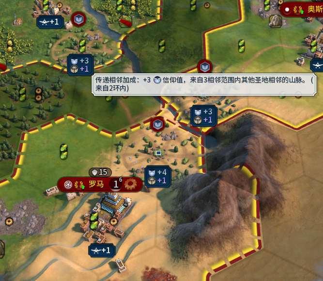

### 3.3.8. 示例-提供Property作为加成-[天童凯伊](https://steamcommunity.com/sharedfiles/filedetails/?id=3671918017)的千年校区

将就看吧：

```sql
--============================================================================================================================
--千年校区：
--+0.5大科学家点数，来自3环内的在岗公民
--+0.5科技，来自3环内的区域
--+1%科技系数，来自区域剩余生命比例
--+10修复光环，来自每1个本区域在岗公民
--+1%千年实验增幅，来自每个已研究的科技
    INSERT INTO Ruivo_New_Adjacency 
    (ID,
     DistrictType,                       ProvideType,            YieldType,                     YieldChange,     AdjacencyType,                         Rings,  DistrictModifiers,  NewMethod,   ModifierOwner,      WhoIsTheOwner,                                      CollectionType) VALUES
  
    ('RUIVO_DISTRICT_R_MILLENNIUM_CAMPUS_GPP_FROM_RINGS_WORKER',
    'DISTRICT_R_MILLENNIUM_CAMPUS',     'GreatPersonPoints',    'GREAT_PERSON_CLASS_SCIENTIST', 0.5,            'FROM_RINGS_WORKER',                    3,      1,                  1,          'TraitModifiers',   'TRAIT_CIVILIZATION_DISTRICT_R_MILLENNIUM_CAMPUS',  'COLLECTION_PLAYER_DISTRICTS'),

    ('RUIVO_DISTRICT_R_MILLENNIUM_CAMPUS_SCIENCE_FROM_RINGS_DISTRICT',
    'DISTRICT_R_MILLENNIUM_CAMPUS',     'SelfBonus',            'YIELD_SCIENCE',                0.5,            'FROM_RINGS_DISTRICT',                  3,      1,                  1,          'TraitModifiers',   'TRAIT_CIVILIZATION_DISTRICT_R_MILLENNIUM_CAMPUS',  'COLLECTION_PLAYER_DISTRICTS'),

    ('RUIVO_DISTRICT_R_MILLENNIUM_CAMPUS_SCIENCE_FROM_HP_PERCENT',
    'DISTRICT_R_MILLENNIUM_CAMPUS',     'SelfMultiplier',       'YIELD_SCIENCE',                1,              'FROM_SELF_DISTRICT_REMAIN_HP_PERCENT', 1,      1,                  1,          'TraitModifiers',   'TRAIT_CIVILIZATION_DISTRICT_R_MILLENNIUM_CAMPUS',  'COLLECTION_PLAYER_DISTRICTS'),

    ('RUIVO_DISTRICT_R_MILLENNIUM_CAMPUS_FIX_RINGS_FROM_RINGS_WORKER',
    'DISTRICT_R_MILLENNIUM_CAMPUS',     'SelfDistrictProperty', 'RUIVO_MILLENNIUM_FIX_RINGS',   10,             'FROM_SELF_WORKER',                     1,      1,                  1,          'TraitModifiers',   'TRAIT_CIVILIZATION_DISTRICT_R_MILLENNIUM_CAMPUS',  'COLLECTION_PLAYER_DISTRICTS'),

    ('RUIVO_DISTRICT_R_MILLENNIUM_CAMPUS_MODIFIER_FROM_PLAYER_TECHS_NUM',
    'DISTRICT_R_MILLENNIUM_CAMPUS',     'SelfPlayerProperty',   'RUIVO_MILLENNIUM_HEALING_BONUS_MODIFIER', 1,   'FROM_PLAYER_TECHS_NUM',                1,      1,                  1,          'TraitModifiers',   'TRAIT_CIVILIZATION_DISTRICT_R_MILLENNIUM_CAMPUS',  'COLLECTION_PLAYER_DISTRICTS');

--+7%千年实验增幅，来自每个已证毕的千年难题
--+7生产力，来自每层循环科技
--+1%尤里卡，来自每次激活的大科学家
    INSERT INTO Ruivo_New_Adjacency 
    (ID,
     DistrictType,                       ProvideType,            YieldType,                       YieldChange,     AdjacencyType,             CustomAdjacentObject,                           DistrictModifiers,  NewMethod,   ModifierOwner,      WhoIsTheOwner,                                      CollectionType) VALUES
    ('RUIVO_DISTRICT_R_MILLENNIUM_CAMPUS_MODIFIER_FROM_PROJECT_R_7_PROBLEMS',
    'DISTRICT_R_MILLENNIUM_CAMPUS',     'SelfPlayerProperty',   'RUIVO_MILLENNIUM_HEALING_BONUS_MODIFIER',  7,   'FROM_PLAYER_PROPERTY',    'PROJECT_R_7_PROBLEMS_COMPELETED_NUM',           1,                  1,          'TraitModifiers',   'TRAIT_CIVILIZATION_DISTRICT_R_MILLENNIUM_CAMPUS',  'COLLECTION_PLAYER_DISTRICTS'),

    ('RUIVO_DISTRICT_R_MILLENNIUM_CAMPUS_YIELD_PRODCUTION_FROM_FUTURE_TECH',
    'DISTRICT_R_MILLENNIUM_CAMPUS',     'SelfBonus',            'YIELD_PRODUCTION',                         7,   'FROM_PLAYER_PROPERTY',    'RUIVO_MILLENNIUM_TECH_FUTURE_TECH_NUM',         1,                  1,          'TraitModifiers',   'TRAIT_CIVILIZATION_DISTRICT_R_MILLENNIUM_CAMPUS',  'COLLECTION_PLAYER_DISTRICTS'),

    ('RUIVO_DISTRICT_R_MILLENNIUM_CAMPUS_YIELD_TECHNOLOGY_BOOST_FROM_SCIENTIST',
    'DISTRICT_R_MILLENNIUM_CAMPUS',     'SelfTechnologyBoost',  'YIELD_TECHNOLOGY_BOOST',                   1,   'FROM_PLAYER_PROPERTY',    'RUIVO_MILLENNIUM_GREAT_SCIENTIST_CHARGE_NUM',   1,                  1,          'TraitModifiers',   'TRAIT_CIVILIZATION_DISTRICT_R_MILLENNIUM_CAMPUS',  'COLLECTION_PLAYER_DISTRICTS');

--为产出添加图标
    INSERT INTO Ruivo_Yield_IconString 
    ( YieldType,                                 Name,                                          IconString,              TextColor,          AddPercentChar) VALUES
    ('RUIVO_MILLENNIUM_FIX_RINGS',              'LOC_RUIVO_MILLENNIUM_FIX_RINGS',              '[ICON_CHARGES]',        '[COLOR:255,167,28,255]',         0),
    ('RUIVO_MILLENNIUM_HEALING_BONUS_MODIFIER', 'LOC_RUIVO_MILLENNIUM_HEALING_BONUS_MODIFIER', '[ICON_RM_MODIFIER_22]', '[COLOR_LIGHTBLUE]',              1);

--为property系列增加文本
    INSERT INTO Ruivo_New_Adjacency_Text (ID, Tooltip)
    VALUES
    ('RUIVO_DISTRICT_R_MILLENNIUM_CAMPUS_MODIFIER_FROM_PROJECT_R_7_PROBLEMS',   'LOC_RUIVO_DISTRICT_R_MILLENNIUM_CAMPUS_MODIFIER_FROM_PROJECT_R_7_PROBLEMS'),
    ('RUIVO_DISTRICT_R_MILLENNIUM_CAMPUS_YIELD_PRODCUTION_FROM_FUTURE_TECH',    'LOC_RUIVO_DISTRICT_R_MILLENNIUM_CAMPUS_YIELD_PRODCUTION_FROM_FUTURE_TECH'),
    ('RUIVO_DISTRICT_R_MILLENNIUM_CAMPUS_YIELD_TECHNOLOGY_BOOST_FROM_SCIENTIST', 'LOC_RUIVO_DISTRICT_R_MILLENNIUM_CAMPUS_YIELD_TECHNOLOGY_BOOST_FROM_SCIENTIST');
--============================================================================================================================
```

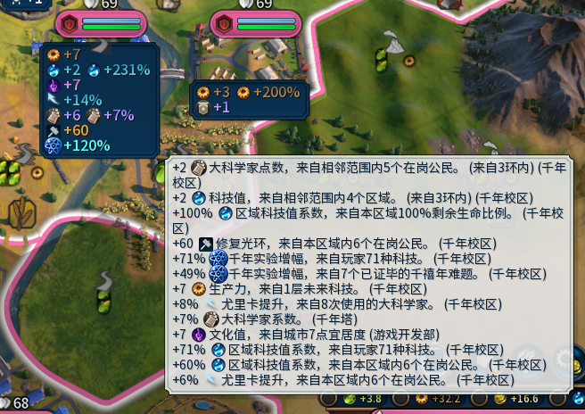

# 4. 结语

嗯，教程大概就是这样，下课！

其他的还在施工中，本mod和教程尚不全面，请见谅！
